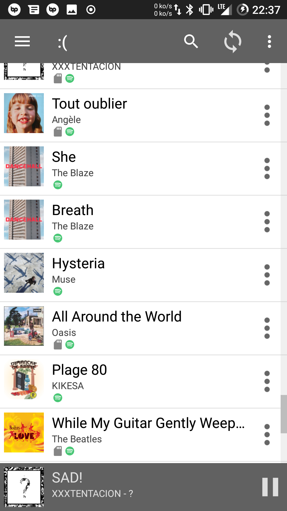
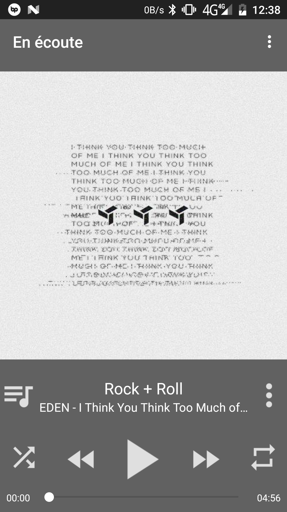
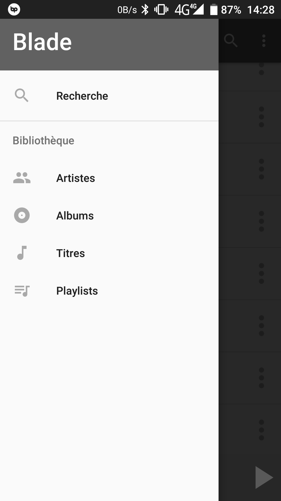

# Blade Player

Blade is a free and open source simple music player built for Android devices. Blade is developed to allow songs to be played from local user libraries and other third-party sources which includes Spotify and Deezer.

  

## Blade-Player features

Blade-Player contain features that makes it an ideal simple music player.

- **Categorized Lists**

Song list contains the list of all the songs in your library.
Artists list groups all the artists of songs in the library.
Album list contains the list of albums.
These lists are sorted according to the metadata or information of the music file,

- **Blade Player supports playlists** 

Already created playlists are available in the music player and new playlists can be created in the app by adding a song from the songs list to a playlist and creating a new one.

- **Search feature** 

Used to quickly search  for songs, artists or albums in the library. 2 search modes : local search (will search on your local/Spotify/Deezer library) and web search (will also search on Spotify and Deezer (can take a little bit of time if you have a bad connection)).

- **Blade-Player doesn't contain unneccesary ads and pop-ups**

- **The app is totally free and open source**

## Releases

[Latest Release (v 1.2)](https://github.com/Valou3433/blade-player/releases/download/v1.2/blade-1.2.apk)

[Mirror](http://valou3433.fr/blade/blade-1.2.apk)

- added ability to edit local songs metadata
- added themes (for now only blade, nightly and green)
- added image generation for local playlists, ...
- fixed bugs

Link to all [Blade-Player Releases](https://github.com/Valou3433/blade-player/releases)

## Informations

Read Blade [Privacy Policy](https://github.com/Valou3433/blade-player/blob/master/Privacy.md)
Read Blade [License](https://github.com/Valou3433/blade-player/blob/master/LICENSE)
[FAQ](https://github.com/Valou3433/blade-player/blob/master/FAQ.md)

## License

## Contributors
- Valou3433 is the main developer
- zularizal made the Blade logo
- HarryHeights and olayhemi made documentation

Contributions to Blade-Player are welcomed. If you want to work on it, you can send me a mail at vhaudiquet343@hotmail.fr or talk to me on GitHub.
You can pen an issue for suggestions or bug reports.
